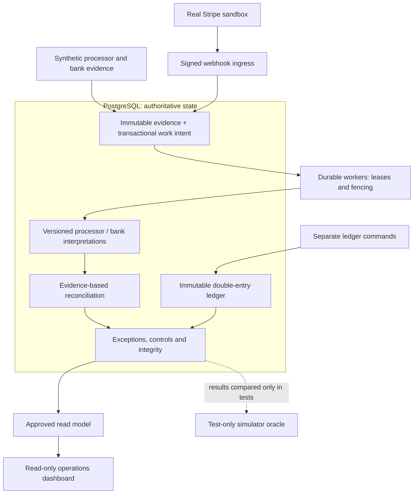
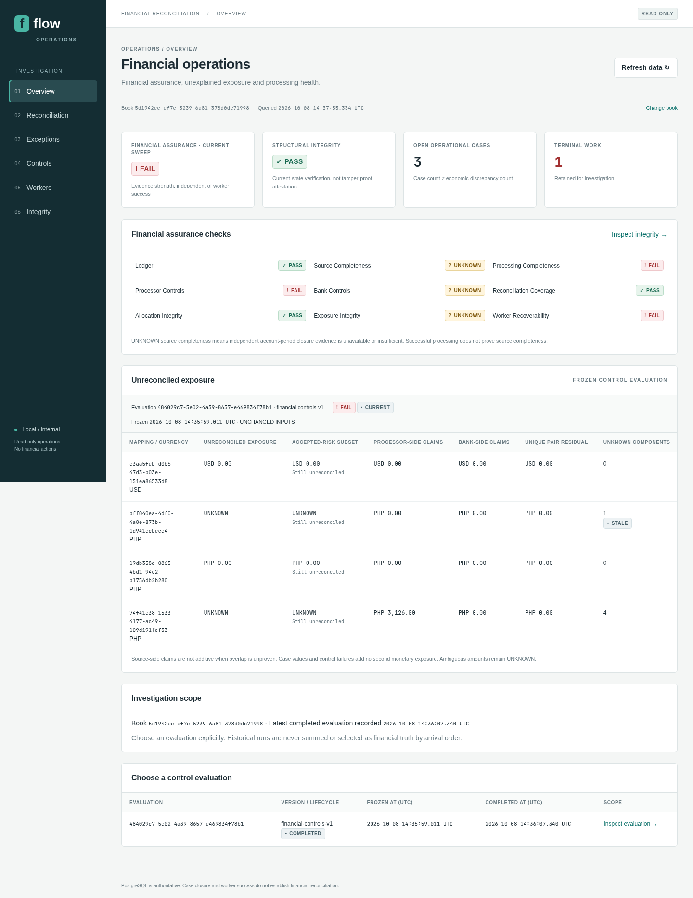

# Flow

Flow is a production-oriented financial reconciliation and exception-management system built as a portfolio project. It compares processor settlement evidence with bank observations, records explainable matches, and keeps discrepancies visible for investigation. An exact-money, immutable double-entry ledger remains a separate accounting boundary.

Reconciliation is difficult because records can arrive late, repeat, change, or describe different parts of the same payment. Fees, refunds and grouped settlements complicate totals; matching amounts alone cannot prove that money arrived.

**Verified:** real Stripe sandbox charge/fee evidence passed hosted HTTPS ingestion and worker processing. **Demo:** AWS runtime is created on demand and normally offline. **Scope:** bank evidence is synthetic; the dashboard is read-only. [Executed evidence](docs/phase15/verification.md).

## What it demonstrates

- **Exact accounting:** integer minor-unit money, explicit currencies and balanced journals enforced by PostgreSQL; corrections preserve posted history.
- **Recoverable work:** financial writes, audit and work intent commit together through a transactional outbox. Semantic idempotency prevents duplicate effects; worker leases and fencing reject expired ownership.
- **Conservative reconciliation:** exact one-to-one and explicitly declared many-to-one settlement matches, frozen evidence populations and unique whole-item allocations.
- **Explainable operations:** separate exceptions, controls and integrity checks; accepted risk stays unreconciled and insufficient evidence stays UNKNOWN.
- **External evidence:** official-SDK Stripe signature verification over raw bytes, immutable provenance, asynchronous enrichment and overlapping recovery without double-booking.
- **Reproducible deployment:** tested non-root containers, restricted database/IAM roles and an ephemeral AWS/Terraform apply–demo–destroy lifecycle.

## Architecture

A TypeScript modular monolith uses Node.js ingress/workers, a Next.js operations application and shared domain libraries in an Nx/pnpm workspace. PostgreSQL owns durable state. The UI presents approved server-only reads; it never decides reconciliation or changes financial records.



External observations never authorize payments or post ledger entries. The dotted path is test verification: oracle data cannot flow into runtime. Independent payment authorization and business-to-ledger orchestration remain deferred. [Current boundaries and code map](docs/architecture/current-system.md) · [Architectural decisions](docs/architecture/adr/README.md).

## Dashboard / demo

The operations dashboard exposes reconciliation evidence, exceptions, control freshness, durable work and financial integrity. The existing screenshot shows actual **Phase 12 local synthetic data**, including financial FAIL and separate structural PASS. It predates hosted Stripe/AWS verification and is not a screenshot of the current cloud deployment.



**The AWS demo environment is created on demand with Terraform and destroyed after demonstrations to avoid idle cloud cost.** The runtime at `flow.edtosoy.com` is intentionally offline after teardown. Use the [local dashboard workflow](docs/phase12/README.md#reproducible-local-workflow) to inspect it without AWS or Stripe credentials.

## Verified system

The [Phase 15 report](docs/phase15/verification.md) records executed evidence from 2026-10-09:

| Evidence                | Verified result                                                                                                                                                                      |
| ----------------------- | ------------------------------------------------------------------------------------------------------------------------------------------------------------------------------------ |
| Hosted Stripe sandbox   | A real signed `charge.succeeded` event passed HTTPS ingress → immutable receipt → durable worker → real Charge/Balance Transaction enrichment → processor charge/fee interpretations |
| Replay and recovery     | Two overlapping backfills retained one raw event, one completion and the same economic derivation identities                                                                         |
| Repository regressions  | Full `pnpm verify` passed, including **293 real PostgreSQL integration tests**; final deployment/access regressions passed **8 tests**                                               |
| Deployment and teardown | **92-resource** runtime created and cleanly destroyed; private RDS, healthy ECS/ALB, valid ACM/HTTPS, scoped IAM and secrets handling checked                                        |
| Reproducibility         | Fresh **92-create** plan passed after destruction; deliberately not applied for a second charged demonstration                                                                       |

External proof covers capture/fee evidence. Refund, dispute and payout scope is exercised by local contracts and real PostgreSQL tests; those reports do not claim additional real external lifecycle demonstrations. Successful ingestion does not prove all-time source completeness or real-bank reconciliation. [Stripe scope and verification](docs/phase14/README.md) · [Measured read performance and limits](docs/phase13/verification.md).

## Cloud deployment

Terraform separates persistent bootstrap (versioned S3 state with native S3 locking, ECR, delegated Route 53 zone and budget) from disposable runtime (ECS Fargate, ALB/ACM, private Single-AZ RDS PostgreSQL, SSM SecureString, scoped IAM and short-retention CloudWatch logs).

Cloudflare remains authoritative for the parent domain; one-time NS delegation lets Route 53 manage `flow.edtosoy.com`. There is **no NAT Gateway**: tasks use public IPs for outbound access, while security groups allow application ingress only from the ALB and database ingress only from authorized tasks. A $10/month budget provides alerts, not a spending cap.

The lifecycle is bootstrap → confirm DNS delegation → build/push pinned images → apply → migrate/provision → demonstrate/verify → destroy. Detailed commands and manual checkpoints stay in the [deployment runbook](docs/phase15/README.md); reproducing the demonstration creates billable AWS resources.

## Design philosophy

- **PostgreSQL is the durability boundary.** Logs, metrics, queues and the browser are observations, not financial authority.
- **Candidates are not matches.** Similar amounts or dates do not establish settlement membership or bank receipt.
- **Ambiguity stays UNKNOWN.** Arrival order, missing evidence and successful processing cannot manufacture completeness.
- **Operational closure is not reconciliation.** Accepted risk remains unreconciled exposure.
- **Evidence and history are immutable.** Corrections add history; independent controls assess current freshness.
- **Tests cannot give runtime the answers.** The simulator oracle is isolated from application and adapter dependencies.

## Inspect or reproduce

For the normal local verification gate, install **Node 24**, **pnpm 11.27.0**, Docker and Chromium (system Chromium, or `pnpm exec playwright install chromium`):

```sh
pnpm install --frozen-lockfile
pnpm verify
```

Integration tests create and clean their own disposable PostgreSQL containers; they do not reset an existing database. Ordinary build/tests and the public synthetic demo need no Stripe credentials or AWS account. [Local dashboard setup](docs/phase12/README.md#reproducible-local-workflow) · [Simulator reproduction](docs/phase2/README.md) · [Stripe sandbox setup](docs/phase14/README.md#developer-workflow).

## Current scope and limitations

Stripe is **sandbox-only**, the bank side is **synthetic**, and the dashboard is **read-only**. Flow does not initiate live payments, provide checkout/billing, or integrate with a real bank. Supported matching remains exact 1:1 and complete-declaration N:1; arbitrary N:M, partial allocations and FX are deferred.

The AWS demo uses disposable Single-AZ RDS data, no HA/restore guarantee, and shared demo access rather than production identity. Local performance observations are not production SLAs. Flow is not presented as production-ready or compliance-certified. **Phase 16 AI work is explicitly deferred.**

## Repository navigation

| Start here                                                                                                         | Contents                                                               |
| ------------------------------------------------------------------------------------------------------------------ | ---------------------------------------------------------------------- |
| [Current architecture](docs/architecture/current-system.md) / [design catalog](docs/architecture/README.md)        | Implemented trust boundaries and historical design documents           |
| [Decision records](docs/architecture/adr/README.md) / [invariants](docs/architecture/invariants.md)                | Durability, exact money, idempotency, matching and security decisions  |
| [Deployment](docs/phase15/README.md) / [latest verification](docs/phase15/verification.md)                         | Apply/demo/destroy workflow and actual hosted evidence                 |
| [Operations app](apps/ops) / [read adapter](libs/operations-read-postgres)                                         | Read-only Next.js dashboard and approved PostgreSQL reads              |
| [Ingress app](apps/integrations) / [Stripe adapter](libs/stripe-integration) / [persistence](libs/stripe-postgres) | Authenticated sandbox evidence and existing worker integration         |
| [Financial libraries](libs) / [migrations](database/migrations) / [tests](tests)                                   | Domain/persistence packages, database enforcement and regression gates |
| [Public simulator](libs/simulator) / [test-only oracle](libs/simulator-oracle)                                     | Deterministic inputs and isolated verification ground truth            |
| [Implementation history](docs/architecture/implementation-sequence.md)                                             | Phase 1–15 scope and evidence; Phase 16 remains deferred               |
