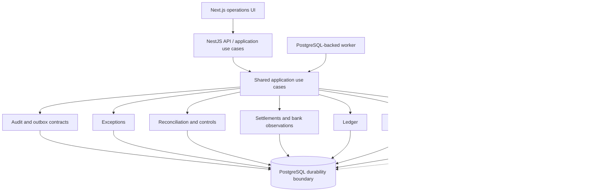

# Phase 0 architecture

Status: approved Phase 0 design baseline, 2026-10-07. Original Phase 0 scope was documentation only. The user subsequently approved the baseline and authorized Phase 1 only. [Phase 1 implementation](../phase1/README.md) makes financial-core choices concrete; [verification](../phase1/verification.md) distinguishes executed guarantees from future controls. The original inspection and validation below describe Phase 0 historical evidence, not the current installed workspace. Phase 2 was subsequently authorized for the [deterministic simulator](../phase2/README.md) only; its [verification](../phase2/verification.md) records the implemented boundary. Phase 3 is subsequently authorized only for [ingestion and versioned normalization](../phase3/README.md); its [verification](../phase3/verification.md) records the evidence foundation and preserves all later-phase deferrals.

## Design package

| Document | Responsibility |
| --- | --- |
| [Invariant catalog](invariants.md) | Numbered controls, enforcement, tests, failures |
| [Conceptual data model](data-model.md) | Identities, ownership, relationships, constraints |
| [State machines](state-machines.md) | Legal transitions and transaction guards |
| [Reconciliation semantics](reconciliation.md) | Proof requirements, grouped matching, completeness |
| [Transactions and outbox](transactions-and-outbox.md) | Atomic writes, locking, leases, retries, durability |
| [Failure and risk analysis](failure-and-risk-analysis.md) | Scenarios A–J, threat ranking, trust limits |
| [Verification and operations](verification-and-operations.md) | Tests, simulator, metrics, runbooks |
| [Implementation sequence](implementation-sequence.md) | Dependency order, gates, open decisions, deferrals |
| [ADRs](adr/README.md) | Consequential architectural choices |
| [Phase 1 implementation](../phase1/README.md) | Actual schema, packages, privileges, command/idempotency/reversal semantics |

## Executive decision

Use an Nx/pnpm/TypeScript monorepo with a Next.js operations UI, NestJS API, and NestJS/TypeScript worker. They share independently testable domain libraries and one PostgreSQL database. Different processes do not imply independently owned services. Docker supplies local PostgreSQL and eventually repeatable development environments. Drizzle may implement ordinary persistence; reviewed SQL migrations, posting routines, constraints, and locks remain first-class where financial correctness requires them. No ORM is allowed to weaken an invariant.

Financial commands commit authoritative state, audit evidence, and required asynchronous intent in one PostgreSQL transaction. Workers process durable work with at-least-once delivery and idempotent effects. No queue, projection, UI, log, or metric is authoritative financial state. The durable tables are not blanket event sourcing: current lifecycle state is stored alongside immutable facts and a separate audit trail.

The system compares four distinct layers: immutable raw source observations; versioned normalized observations; independent internal business expectations and posted accounting; and versioned reconciliation evidence/results. Receiving a processor transaction does not establish that an internal payment exists, that the ledger is correct, or that the bank received funds.

An item can be reconciled for one relationship and still pending for another. A completed run accounts for its frozen population; it may still contain unresolved items. Period-level assurance additionally requires verified source manifests and independent financial control totals. Unknown coverage remains explicitly unverified.

## Initial accounting and scope assumptions

1. Start with one synthetic merchant legal entity/book, one processor account, one bank account, and a small versioned currency allowlist. Scope all keys by book and source account from the beginning; defer a multi-tenant product.
2. The system observes and accounts for activity; it does not initiate payments, refunds, payouts, or other money movement. Internal payment/refund expectations arrive through a separate synthetic internal source or explicit authorized internal command. They are not manufactured from processor observations to make matching succeed.
3. Initial journals are single currency. Each account has one immutable currency and accounting classification. Currency conversion and functional-currency reporting are deferred; cross-currency records are retained and surfaced as unsupported exceptions. Rates, if retained as evidence, are exact decimal strings/NUMERIC with a declared scale.
4. A sample merchant model uses sales/refund/fee accounts, processor receivable, settlement in transit, and bank cash. Revenue recognition, custodial liabilities, taxes, reserves, chargeback policy, and legal accounting treatment require domain approval before real accounting. The examples demonstrate mechanics, not an approved chart of accounts.
5. Bank pending observations are not booked cash evidence. Processor payout status is not bank receipt evidence. Expected availability, occurrence, effective/book date, observation time, and ingestion time are separate concepts.
6. No automatic amount tolerance or write-off in V1. Fee, rounding, reserve, refund, and adjustment differences require explicit evidence and, when applicable, approved separate accounting entries.
7. Production readiness requires demonstrated controls, authorization, backups/restore drills, security review, and operational ownership. A design alone cannot prove these.

## Module ownership and dependency direction

An arrow means **imports/uses public contract of**, not a database foreign-key direction. Foundation modules do not import domain modules. Domain code has no dependency on NestJS, Next.js, Drizzle, the worker scheduler, simulator, or telemetry exporters. Persistence adapters and the application composition layer supply those implementations.

| Bounded module | Owns | Allowed domain dependencies |
| --- | --- | --- |
| Money/shared financial primitives | Money, currency metadata, exact arithmetic, amount bounds, time/identity value types; no generic business dumping ground | None |
| Ingestion | Source accounts, batches/manifests, raw receipts, canonical source identities/revisions, source coverage | Shared |
| Normalization | Versioned typed interpretations, parse dispositions, supported source mappings | Ingestion read contracts, shared |
| Payments | Internal payment expectations and capture/refund/chargeback activities, approved business transitions | Shared |
| Ledger | Accounts, journals/entries, posting/reversal API, business-effect idempotency, integrity verification | Shared |
| Settlements | Expected/reported payout, batch composition, processor reports and bank observations; owns bank model initially | Normalization read contracts, shared |
| Reconciliation | Comparable items/facets, rules, immutable run populations, decisions, match groups, current allocations, control evaluations | Read contracts of normalization, payments, ledger, settlements; shared |
| Exceptions | Cases, evidence, assignments, reviews, resolution dispositions; no direct financial edits | Shared |
| Audit | Append-only attributable decision records and controlled query API | Shared identities/contracts |
| Async/outbox | Durable events, per-handler work, attempts, leases, retry/recovery | Shared contracts; no domain imports |
| Observability | Log/metric/trace adapters, freshness and independent control-check scheduling | Shared contracts; no domain ownership |
| Simulator | Seeded scenarios, source artifacts, delivery fault schedule | Shared format contracts only; no runtime production import of simulator |

Application use cases sit above these modules. They coordinate payments + ledger + audit + outbox inside a shared transaction, or reconciliation + exceptions + audit. Exceptions do not import reconciliation and reconciliation does not import exceptions: the coordinator connects them through IDs and results. Typed cross-module foreign keys are valid; arbitrary writes to another module's tables are not. The ledger never calls the payments module to decide accounting correctness. Settlement observations never directly mark reconciliation complete.

Bank transactions need a distinct concept and trust boundary, but not a separate package immediately. Split a bank module only if bank-specific behavior becomes cohesive enough to justify it. Completeness/control evaluations belong to reconciliation, with source coverage inputs owned by ingestion.

Proposed logical layout, not directories scaffolded in Phase 0:

```text
apps/web       -> API contracts only
apps/api       -> application use cases + adapters
apps/worker    -> same application use cases + durable handler adapters
libs/*/domain  -> pure domain logic and public contracts
libs/*/data    -> PostgreSQL adapters owned by that module
libs/application -> transaction coordination and composition
tools/simulator -> scenario generator and isolated evaluator
```

Implement Nx tag restrictions and cycle checks when scaffolding. Nx documents tag-based enforcement through its [module-boundary lint rule](https://nx.dev/docs/features/enforce-module-boundaries). No enterprise capability is required for this design.



The diagram shows runtime composition, not permission to introduce circular library imports. Simulator ground truth never flows into the system under test.

## Terminology

| Term | Precise meaning |
| --- | --- |
| Payment | Internal business object expressing an obligation/intent to accept funds; not a processor event or ledger entry. Capture is a separate activity. |
| Payment activity | Independently identified internal capture, refund, refund portion, chargeback, or adjustment with its own amount and lifecycle. |
| Processor transaction | External processor balance-affecting fact, such as a charge, fee, refund, or dispute movement. An API payment object, webhook envelope, and balance transaction have different identities. |
| Settlement | An expected or processor-reported transfer from processor balance toward a bank account; bank receipt is a separate observation. |
| Settlement batch | Versioned processor-reported set of balance components assigned to a payout. A payout without itemized membership has unverified composition. |
| Bank transaction | External bank observation of a credit/debit, with pending/booked status, booking/value dates, source identity, and revisions. |
| Ledger account | Currency-specific accounting bucket in a book with an immutable accounting classification and normal balance side. |
| Ledger transaction / journal | Atomic, posted collection of debit and credit entries representing one accounting action. “Transaction” without a qualifier is avoided. |
| Ledger entry | One positive minor-unit debit or credit to one account in one journal; never an external-source row. |
| Source record | Immutable received row/event observation, including exact source representation and provenance. Retransmissions remain observations even when they refer to one canonical fact. |
| Source fact/revision | Canonical, scoped external object identity and an immutable reported version of that object's facts. Distinct from delivery identity. |
| Normalized record | Immutable, versioned interpretation of a source revision using a named parser/normalizer. Normalization adds meaning, not accounting truth. |
| Reconciliation | Evaluation of a defined financial relationship over a declared population using explicit evidence and versioned rules. |
| Match | A proposed or confirmed correspondence of items satisfying one rule; a candidate is not financial proof. |
| Match group | Auditable evidence bundle with members, roles, signs, and relationship scope supporting a 1:1, N:1, or approved 1:N equation. |
| Exception | Explicit case for an unresolved discrepancy, unsupported fact, processing failure, or breached control. Not every not-yet-due item is an exception. |
| Reversal | New journal exactly negating the entries of a specified original journal; the original stays posted. Replacement accounting is another new journal. |
| Idempotency key | Scoped stable identity of an intended operation/effect; same key and payload returns the original result, conflicting payload is rejected. Not a random key per retry. |
| Reconciliation run | Immutable population snapshot and rule version, plus resumable processing and append-only outcomes. Completion means population accounting finished, not all items reconciled. |
| Reconciled | Proven relationship for specified items, facet, evidence revisions, and rule; does not imply end-to-end settlement or source completeness. |
| Resolved | Exception workflow conclusion with a disposition; accepted risk can be resolved without being reconciled. |
| Control total | Independent count/amount/balance assertion over a stated source/account/currency/period with explicit coverage quality. |

## Evidence and technical references

Official documentation was checked on 2026-10-07. PostgreSQL “current” resolved to version 18; links below are pinned to 18 for review reproducibility. No project database/framework version is pinned or installed in this workspace. Pin and revalidate actual versions during Phase 1, rather than treating these references as an installed-version test.

- [PostgreSQL constraints](https://www.postgresql.org/docs/18/ddl-constraints.html): row checks, uniqueness and referential integrity; cross-row balance needs another enforcement mechanism.
- [Numeric types](https://www.postgresql.org/docs/18/datatype-numeric.html): exact integer/NUMERIC representation and special-value caveats.
- [Constraint triggers](https://www.postgresql.org/docs/18/sql-createtrigger.html): deferred checks at transaction end.
- [Isolation](https://www.postgresql.org/docs/18/transaction-iso.html), [locking](https://www.postgresql.org/docs/18/explicit-locking.html), [SELECT](https://www.postgresql.org/docs/18/sql-select.html), [INSERT](https://www.postgresql.org/docs/18/sql-insert.html): transaction and work-claim mechanisms.
- [WAL reliability](https://www.postgresql.org/docs/18/wal-reliability.html): durability depends on database/storage configuration.
- [Stripe payout reconciliation](https://docs.stripe.com/reports/payout-reconciliation): payout composition evidence depends on payout/report type. This is a constraint on the later adapter, not an assumption that test mode provides bank evidence or every production report.

All financial policies in this package are proposed system controls. External technical sources support mechanism claims, not approval of accounting treatment or jurisdiction-specific requirements.

## Phase 0 validation performed

- **PASS:** executed Node filesystem/Markdown validation over 21 documents: 36 local links resolve; no trailing whitespace, missing final newlines or unpaired code fences; only Markdown artifacts under the documentation tree.
- **PASS:** executed catalog check: 17 sequential invariant IDs, each with purpose/DB/application/test/failure fields; all invariant references valid; ten proposed ADRs; all scenarios A–J present.
- **PASS:** executed topic-presence check across eight groups: modules, terminology, state machines, matching, testing, metrics, transactional work and roadmap. This verifies coverage, not semantic correctness.
- **REVIEWED:** cross-document consistency of journal construction/commit guards, semantic idempotency, canonical bank/component identity, cross-run allocations, closed-account reversal, current-proof invalidation and staged implementation gates. Review is not an independent adversarial review or executed application test.
- **NOT RUN:** money/property tests, PostgreSQL constraints/roles/triggers/concurrency tests, simulator, migration and load checks. No implementation exists; these remain explicit future gates.
- **SKIPPED:** Git diff/whitespace checks because the workspace has no usable Git metadata. The executed document checker covers whitespace and file scope; no commit/push occurred.

No application scaffolding, dependency installation, deployed resource, or production behavior was introduced during Phase 0. The baseline has since been approved; Phase 1 implements only its financial-core slice. Real-data accounting policy, authorization and production readiness remain conditional on later decisions/gates.

Phase 4 now implements [processor claims and settlement expectations](../phase4/README.md), preserving independent internal payment authorization and accounting truth. [ADR-011](adr/011-processor-interpretations.md) records the scope distinction. Phase 5 and later remain deferred.
