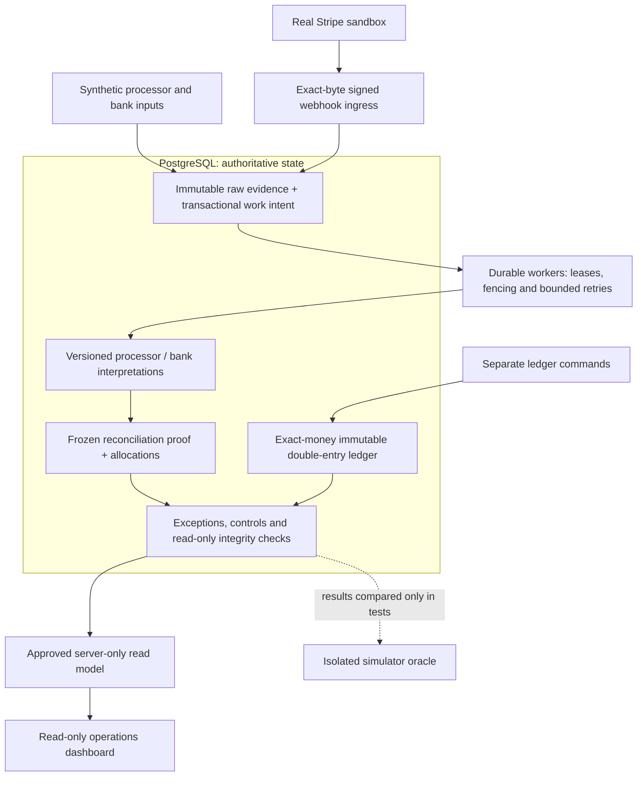
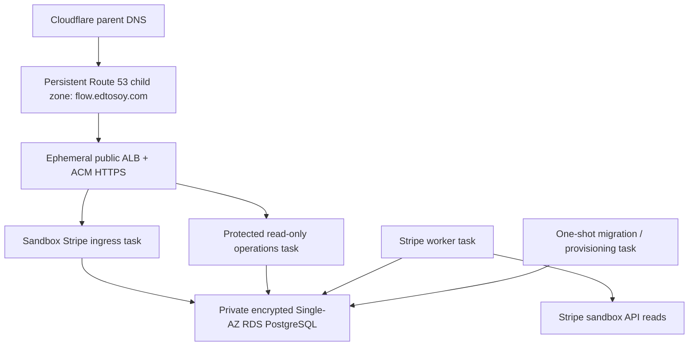

# Current system architecture

Flow is a TypeScript modular monolith for financial reconciliation and exception management. Shared domain libraries run in a Next.js read-only operations app, Node.js Stripe ingress and PostgreSQL workers, with CLI/one-shot workflows for administrative and financial operations. PostgreSQL is the authoritative durability boundary. This page describes the implemented Phase 1–15 system; the [original design catalog](README.md) preserves the Phase 0 proposal.

## Evidence and financial authority

Arrows show evidence flow, not permission to write another domain's tables or a promise that every step runs automatically. The existing workers normalize/enrich accepted evidence; reconciliation and control workflows use their own existing command boundaries. The simulator supplies deterministic public artifacts; its oracle is available only to test evaluators and never to runtime.

Stripe reports what Stripe observed. A signed event does not authorize an internal payment, post a journal, prove bank receipt or establish complete source history. Independent payment authorization and business-to-ledger orchestration remain deferred. The implemented ledger mechanics are a separate boundary, not an automatic posting path from external evidence.

| Boundary        | Guarantee and limitation                                                                                                                                                                          |
| --------------- | ------------------------------------------------------------------------------------------------------------------------------------------------------------------------------------------------- |
| Ingestion       | Exact accepted bytes, source identity, revisions and provenance are immutable. Stripe acknowledgement follows committed raw evidence and transactional work intent.                               |
| Interpretation  | Provider adapters map evidence into versioned domain contracts. Stripe API enrichment is asynchronous; external SDK types stay outside the financial core. Bank evidence remains synthetic.       |
| Ledger          | Explicit currencies and integer minor units; PostgreSQL-enforced balanced, immutable posting and reversals. No inferred business authorization.                                                   |
| Durable workers | At-least-once execution, database-clock leases, fencing, bounded retries and retained attempts. Semantic identities prevent duplicate financial effects.                                          |
| Reconciliation  | Exact 1:1 and complete-declaration N:1 settlement–bank proof; frozen populations and unique whole-item allocations. Candidates and similar totals are not matches.                                |
| Assurance       | Exceptions track operational handling separately from money. Accepted risk remains unreconciled. Controls preserve PASS/FAIL/UNKNOWN and current freshness; integrity checks do not repair truth. |
| Operations      | Narrow database reads and protected demo access. Technical readiness remains independent of financial assurance; the browser cannot mutate financial records.                                     |

## Code map

| Area                          | Entry points                                                                                                                                                                                       |
| ----------------------------- | -------------------------------------------------------------------------------------------------------------------------------------------------------------------------------------------------- |
| Exact accounting              | [Money](../../libs/money), [ledger domain](../../libs/ledger-domain), [ledger persistence](../../libs/ledger-postgres)                                                                             |
| Evidence                      | [Ingestion domain](../../libs/ingestion-domain), [ingestion persistence](../../libs/ingestion-postgres), [processor](../../libs/processor-domain), [bank](../../libs/bank-domain)                  |
| Stripe boundary               | [Ingress app](../../apps/integrations), [adapter](../../libs/stripe-integration), [persistence/worker integration](../../libs/stripe-postgres), [worker entry point](../../tools/stripe-worker.ts) |
| Reconciliation and assurance  | [Reconciliation](../../libs/reconciliation-domain), [exceptions](../../libs/exception-domain), [controls](../../libs/control-domain), [integrity](../../libs/integrity-postgres)                   |
| Operations and durable work   | [Next.js app](../../apps/ops), [approved reads](../../libs/operations-read-postgres), [PostgreSQL workers](../../libs/worker-postgres)                                                             |
| Enforcement and test evidence | [Migrations](../../database/migrations), [integration tests](../../tests), [public simulator](../../libs/simulator), [test-only oracle](../../libs/simulator-oracle)                               |

The implemented applications use Node.js and Next.js directly. NestJS, an ORM and a separate general-purpose API server from the original proposal are not required by this system. Core financial packages remain provider-independent; persistence adapters and application composition connect them.

## Ephemeral AWS demo

These are ECS Fargate tasks, not separate financial systems. Only administrative one-shot provisioning uses the migration credential; services use distinct narrow database logins and scoped IAM. SSM SecureString supplies runtime secrets, ECR supplies digest-pinned images and CloudWatch retains bounded service logs. Public task IPs enable outbound access without a NAT Gateway; security groups restrict inbound application traffic to the ALB and database traffic to authorized tasks.

Versioned S3 remote state with native locking, ECR, the delegated child zone and budget remain as bootstrap. Runtime infrastructure, secrets and disposable data are destroyed after demonstrations. A $10/month budget is an alert guardrail, not a hard cap. Shared demo access, Single-AZ RDS and disposable data do not constitute production identity, high availability or disaster recovery.

## What was proven

The [Phase 15 verification report](../phase15/verification.md) records hosted signed Stripe sandbox capture/fee evidence, overlapping backfill deduplication, full repository verification, actual 92-resource deployment/destruction and an unapplied recreation plan. Other external financial lifecycles are not claimed from local contract fixtures. The bank side is synthetic and Phase 16 AI remains deferred.

Use the [deployment runbook](../phase15/README.md) for apply/demo/destroy procedures, the [invariant catalog](invariants.md) for financial guarantees and the [ADRs](adr/README.md) for consequential decisions. Historical reports retain the limits of the evidence executed at each phase.
