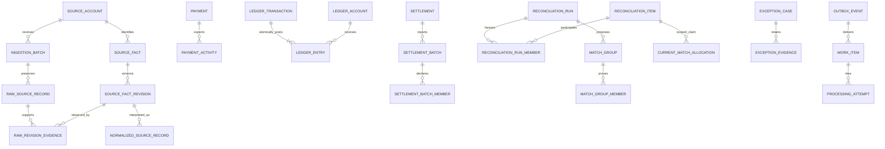

# Conceptual data model

This is an entity/relationship design, not Drizzle schemas or deployable DDL. Implement entities only when their milestone needs them. All financial/provenance/decision FKs default to RESTRICT; no cascade deletion of financial evidence. Runtime roles cannot disable guards. SQL migrations must name and test every promised constraint.

Phase 1 now realizes the generic currency/book/account/journal/entry/command-receipt/audit/outbox slice through [reviewed SQL](../../database/migrations/001_financial_core.sql), described in the [actual schema](../phase1/README.md). Accounts are immutable/open only; account closure, evidence links to later modules, approvals, consumers/work/leases and all source/reconciliation entities remain conceptual. Audit/outbox are creation-only in this milestone and require reviewed evolution for later lifecycle events.

Phase 3 realizes the source/account, atomic sealed batch, exact-byte receipt, conservative source revision, versioned movement interpretation and per-receipt disposition slice through `002_ingestion.sql`. See the [actual ingestion model](../phase3/README.md) for implemented identity, limits and controls. Manifests are optional immutable batch evidence; fact active/latest views are derived conservatively; normalization requests reuse existing audit/outbox. Full workers, typed settlement/bank projections and all reconciliation entities remain conceptual.

## Conventions and identities

- Internal PKs are opaque UUIDs. External IDs are exact strings, never JavaScript numeric values. Identity always includes book, environment (synthetic/test/live), source/provider, source account, object kind, external ID and, where appropriate, revision. Test and live identities must never overlap.
- `book` and `source_account` are small scope entities, not a new tenancy platform. Composite FKs carry book/source scope where accidental cross-scope links would be dangerous. Accounts have fixed currencies. Timestamps are UTC `timestamptz`; source-local dates/time zone and date precision are retained when meaningful.
- Monetary magnitudes are BIGINT minor units, TypeScript bigint, JSON integer strings. Ledger entry magnitudes are positive plus debit/credit side. Source movements have a signed amount or magnitude plus explicit direction, consistently defined per normalized type. Unknown amount is NULL with explicit unresolved interpretation, never zero. Totals may need wider exact NUMERIC than a single BIGINT amount.
- Exact rate evidence has a declared decimal precision/scale, positive finite value, base/quote currencies, source, observation time, and rounding-policy version. V1 cannot post FX merely because a rate exists.
- Immutable facts have `created_at`/`ingested_at`, content hash and relevant occurrence/effective times. Mutable lifecycle rows have `state`, DB `updated_at`, and monotonically incremented `version` for compare-and-set commands. Financial decisions also have immutable history, not just `updated_at`.
- A raw receipt, source object identity, source revision, normalized interpretation, business command, financial effect, and reconciliation decision each have distinct identities. Never make a parser version or run ID part of the key of an already-recognized business effect.

## Source and processing layer

| Entity / owner | Identity, fields and relationships | Constraints, immutability and mutable state |
| --- | --- | --- |
| `book`, `currency_definition` / shared + ledger configuration | Book PK and fixed accounting basis configuration; currency code + metadata version, minor-unit scale, supported status | Currency FK required for every amount; changing scale creates a new supported metadata version and migration plan, not reinterpretation of old units. Initial book policy fixed before posting. |
| `source_account` / ingestion | PK; book, environment, provider, external account identifier, account kind, timezone, enabled adapters | Unique full scoped source identity. Credentials live outside evidence tables. Account identity immutable; activation/configuration versioned. |
| `ingestion_batch` / ingestion | PK; source_account FK; import request key; file/poll interval/event bundle identity; exact source artifact/hash; first/last receipt time; expected/observed physical counts and manifest FK; state/version | Unique source-account + import request key with request hash. A retry resumes batch, not a new financial identity. Mutable loading/finalization state; sealed artifact and row population immutable. A repeated file may be a new batch of duplicate receipts, not new facts. |
| `source_manifest` / ingestion | PK; batch/source interval FK; independently reported expected physical rows, distinct IDs if provided, per-currency totals, sequence bounds/cursor closure, opening/closing balance, source report revision and hash; coverage state | Immutable manifest evidence. Each control identifies which fields actually exist; NULL is unknown. Unique provider report identity/revision within scope. Verification cannot rely on a total recomputed from imported rows. |
| `raw_source_record` / ingestion | PK; batch FK, physical row/index or receipt locator, envelope ID, original identifiers/lexemes if parseable, exact bytes/text, checksum, ingestion timestamp, parser version, authentication outcome | Unique `(batch_id, locator)`; all provenance immutable. Malformed and duplicate rows retained. Payload conflicts do not overwrite previous bytes. Signed-byte verification precedes treating a webhook as trusted source evidence. |
| `source_fact` / ingestion | PK; stable scoped external object identity, object kind; current revision pointer/version | Unique `(source_account_id, object_kind, external_id)` with non-null components; no synthetic ID pretending to be external. Source account carries book/environment. Current pointer can move only via guarded correction workflow. |
| `source_fact_revision` / ingestion | PK; source_fact FK; upstream revision token or adapter-declared revision identity, content hash, primary raw_record FK; occurrence/effective/observation timestamps; predecessor link | Unique `(source_fact_id, revision_key)`; same revision/different hash is a conflict case. Unversioned sources use content hash for immutable observations but do not order revisions by hash. Supersession requires authoritative sequence/as-of evidence or human review. |
| `raw_revision_evidence` / ingestion | PK/composite key raw_record + fact_revision; relationship reason (origin/retransmission/corroboration) | Required because one event can contain multiple source facts and many receipts can report one fact. FKs and unique pairs. Append-only; every receipt has a disposition even if no financial fact can be parsed. |
| `normalized_source_record` / normalization | PK; fact_revision FK; raw evidence links; parser/normalizer version; typed kind, exact amounts/currency, signed components, external reference strings, dates/precision, source-status evidence; interpretation hash | Unique `(fact_revision_id, normalizer_version, output_kind, output_index)` with deterministic output index. Immutable interpretation. Fee/refund components remain individually identifiable. Multiple interpretations are not independently postable facts. Selected interpretation version is policy, not “latest wins.” |
| `processing_disposition` / normalization/application | PK; raw record FK + stage/version; state, output references, duplicate-of references or failure case, version; completion time | Unique receipt + stage/version. All receipts get initial durable work and disposition atomically. Duplicate-linked still counts as processed receipt, not as another source fact. Controlled transitions; successful output retained across reprocessing. |

An upstream snapshot's unchanged financial amount may still have a changed status or reference. The revision hash binds the entire source representation; application policy distinguishes nonfinancial changes from economic corrections. Never generate another capture because a status snapshot arrived under another event ID.

## Internal business and accounting layer

| Entity / owner | Identity, fields and relationships | Constraints, immutability and mutable state |
| --- | --- | --- |
| `payment` / payments | PK; book; independently supplied internal payment reference; customer/order surrogate if synthetic; intended amount/currency; lifecycle state/version; creation/authorization/cancellation timestamps | Unique book + internal reference; command key/hash. Frozen business identity. Authorized amount changes are new versioned commands, never source overwrites. Processor external references are mapping evidence, not payment PK. |
| `payment_activity` / payments | PK; payment FK; kind (capture/refund/chargeback/adjustment); independently identified business action key; expected amount/currency; parent capture activity FK for refunds; state/version and economic date | Unique book + action key; payment/book/currency FKs; internal refund approval locks capture/payment aggregate and prevents cumulative approved refund exceeding refundable capture unless a separately approved adjustment policy applies. External over-refunds are still imported and become discrepancies. Multiple partial refunds are separate activities. |
| `ledger_account` / ledger | PK; book, code, classification, normal side, fixed currency; opened_at/closed_at, state/version | Unique book + account code; currency/classification/normal side immutable after use; closed accounts reject ordinary new postings but allow an explicitly approved exact reversal of their original entry through the correction routine. Replacement uses open accounts. Historical entries remain valid. No authoritative mutable balance column. |
| `ledger_transaction` / ledger | PK; book/currency; posting request key/hash, business-effect namespace/key; policy version; posted_at/effective_at, actor/reason; public immutable state `posted`; nullable reversal_of FK | Unique book + business-effect namespace/key; unique command key; unique non-null reversal_of for V1 full reversal. Internal `constructing` state exists only inside posting transaction and is forbidden at commit; no committed draft. Original and reversal same book/currency. A corrected replacement has its own effect key tied to correction command. |
| `ledger_entry` / ledger | PK; journal FK, stable line number, account FK, side, positive amount_minor, currency/book; exact economic purpose/reference | Unique journal + line number, NOT NULL, positive amount CHECK, side enum; composite account/journal scope FKs. All entries immutable. Parent guarded against late inserts. Per-journal sum verified by deferred trigger, not application-only check. |
| `financial_effect_evidence` / ledger application adapter | Journal FK; payment_activity or source fact/revision or correction approval FK; causal role, policy version | Typed nullable FKs with allowed-target checks, not arbitrary strings standing in for referential integrity. Append-only many-evidence relation. A later corroborating receipt can add evidence, never alter entries. |
| `correction_approval` / application + audit | PK; command hash, original journal FK, proposed reversal/replacement payload hashes, proposer/reviewer, reason, evidence, decision times | Before real use, distinct authorized reviewer required. Approval bound to exact payload and optimistic version; one execution result for command key. No auto-authorized financial write from a reconciliation rule. |

## Settlement and bank layer

| Entity / owner | Identity, fields and relationships | Constraints, immutability and mutable state |
| --- | --- | --- |
| `settlement` / settlements | PK; book/processor source account; expected schedule/business key; expected amount/currency when known, due window/policy; nullable reported payout source_fact FK; lifecycle state/version | Unique expected business key within scope; unique reported payout identity. Expectation and report link is explicit evidence, not amount/date inference alone. Reported amount/revisions remain in source layer. Missing amount is unknown, not 0. |
| `settlement_batch` / settlements | PK; settlement FK; source report revision FK; declared membership count and currency totals; composition state/version | Unique settlement + report revision; reported composition immutable after seal. No assumption every payout has an itemized batch. Reconciliation proof uses declared revision, not a mutable array. |
| `settlement_batch_member` / settlements | Batch FK; source_fact/revision or unresolved scoped external component reference; role (capture/refund/fee/dispute/reserve/adjustment), signed expected contribution | Unique batch + component identity + role; immutable reported membership. Unresolved external references may exist before their source facts; do not force placeholder payments or financial records. Guard linking on book/account/currency and preserve original reference. |
| `bank_transaction` / settlements | PK; bank source_account and source_fact FK; pending/booked/reversed external status projections; source revision FK; booked amount/currency, booking/value dates, transfer references | Unique source fact; pending and booked observations must link only with adapter-supported identity, never loose amount/date deduplication. Derived current view is versioned; immutable bank source revisions retained. No bank record is a ledger entry. |

## Reconciliation, cases and controls

| Entity / owner | Identity, fields and relationships | Constraints, immutability and mutable state |
| --- | --- | --- |
| `reconciliation_rule_version` / reconciliation | PK; immutable rule identifier/version, implementation/configuration hash, relationship scope, supported item kinds, time/amount/reference requirements, currency and completeness policy | Unique rule ID + version; approved activation is auditable. Rule code artifact must remain reproducible. No dynamic SQL or undocumented mutable rules. |
| `reconciliation_item` / reconciliation | PK; book; stable canonical economic origin/component. Exactly one typed origin FK: source_fact, payment_activity, ledger_entry, or independent settlement expectation | CHECK exactly one origin; unique per origin/component (partial unique indexes where required). Bank observations use their source_fact identity; bank/normalized projections cannot register another item for it. Reported payouts likewise use source_fact; settlement-origin items represent independent expectations only. Amount/view comes from selected immutable run evidence. No `(entity_type, arbitrary_id)` without real FKs. Controlled registration and rule guards forbid overlapping gross/net representations in one scope. |
| `reconciliation_run` / reconciliation | PK; scoped relationship/rule FK; source periods/account/currency and cutoffs; replay/supersedes_run FK; snapshot counts/hash/totals and coverage status; state/version; started/sealed/completed timestamps | Run population/rule frozen on seal. No finalization unless each member has explicit outcome; one active execution identity per scheduled run key. Operational resume is same run; new evidence/rule creates new run. |
| `reconciliation_run_member` / reconciliation | PK or `(run_id,item_id)`; selected source/normalizer revision FKs or immutable ledger origin; frozen amount/currency/reference/dates; initial/current outcome pointer | Unique run + item; immutable snapshot payload. Current outcome points to append-only decisions. Counts reconcile to sealed population; no delete-on-unmatched. Ledger facet is an entry/account effect, never the zero net sum of a balanced journal. |
| `reconciliation_decision` / reconciliation | PK; run/member/group FKs as appropriate; previous/new outcome; rule/evidence versions; rationale, proof equations, actor, decision time; supersedes_decision FK | Append-only; outcomes pending/reconciled/exception/under_review/resolved_unreconciled; decisions link to audit. Later invalidation is a new decision, not an update to old proof. |
| `match_group` / reconciliation | PK; run/rule/scope FK; kind 1:1/N:1/1:N, equation and evidence digest; proposed/confirmed/rejected/revoked state/version | Confirmed/revoked proof payload immutable; guarded confirmation validates references, currency, conservation, supported shape and allocation uniqueness. Candidates do not allocate value. |
| `match_group_member` / reconciliation | Group FK; item/run_member FK; side, role, signed contribution, currency; selected evidence revision | Unique group + item + role; V1 whole economic items only. One fact may have different checked facets across scopes, not unbounded partial slices. Financial facts not duplicated to force a desired shape. |
| `current_match_allocation` / reconciliation | PK `(item_id, relationship_scope)`; confirmed group/member FK; decision FK, generation | Enforces at most one active group per stable economic facet/scope across all runs. Controlled confirmation/revocation updates allocations; group history remains. Trigger/routine validates group is confirmed and member belongs. This is a rebuildable current index protected transactionally, not audit history. |
| `exception_case` / exceptions | PK; book/category, stable subject + control key; state/version; priority, assignee, due_at, opened/updated/resolved times; resolution disposition | Prevent duplicate active case for same subject/category/control scope using partial unique key; related evidence can grow. State is one enum. Resolution without reconciliation explicitly records accepted-risk/unsupported/fixed/etc. No deletion when closed. |
| `exception_evidence` / exceptions | PK; case FK; typed links to raw/revision/run/member/group/journal/control evaluation or immutable human attachment; actor/time/hash | Append-only; validate actual target FK/attachment storage identity. Evidence is access controlled. Case links are not a second matching mechanism. |
| `control_evaluation` / reconciliation | PK; scope/account/currency/period; formula/version; external manifest/balance evidence FK; snapshot input counts/hash, exact computed totals, external totals, residual, result, case FK | Unique scheduled evaluation identity. Immutable evaluations; repeat yields new evaluation/version, not overwritten total. Result pass/fail/unverified; pass requires independent evidence. Period-boundary/timezone definitions frozen. |

`exception` is called `exception_case` to avoid overloaded language/SQL terminology. A run may finish while cases remain open. The current allocation table is deliberately additional to historical match members: a uniqueness constraint per run cannot prevent the same bank transaction being consumed in two different runs.

Economic component identity is canonical, not a user-selected view/facet label. For a processor record containing gross capture and fee, register the distinct capture and fee components once; net is a derived equation/view, not a third independent resource available for consumption. Each relationship rule specifies its permitted canonical components. Changing a view/normalizer/rule cannot create an alternate allocation identity. A registration routine enforces origin kind and component schema, including source-fact identity for all bank/projection views. Unique keys alone are insufficient if alternate representations can invent new item identities; direct item registration is therefore restricted.

## Audit and durable work

| Entity / owner | Identity, fields and relationships | Constraints, immutability and mutable state |
| --- | --- | --- |
| `audit_event` / audit | PK; book, actor type/ID/role, action, subject, prior/new state/version, DB time, reason, typed evidence links, correlation/command key, policy version | Append-only, required fields; subject/evidence use typed integrity links where control-critical. State and audit committed together. Financial payloads redacted in logs, not erased from controlled audit. DB timestamp is not a total global ordering; entity version establishes causal sequence. |
| `outbox_event` / async | PK; book, aggregate identity/version, event type/schema version, immutable payload or immutable entity references/hash; created_at and causation/correlation key | Unique aggregate/action version/event kind or explicit event key; created in authoritative write transaction. Payload retention until consumers and retention policy allow archive. Event itself is a fact, not a lease. |
| `work_item` / async | PK; event FK or scheduled/input subject; handler ID/version, operation/effect identity; state/version, available_at, lease_owner/token/generation/until, attempt count, last error class, completion time | Unique event + handler registration (or stage/input/version for scheduled work); NOT NULL work identity. One lease state, not independent booleans. Work and handler receipt/effect transition guarded. Adding a new handler requires a backfill plan, not assuming old events had that delivery. |
| `consumer_receipt` / async | PK/composite event + handler; request hash, effect/result references, processed_at | Unique scoped consumer identity; inserted with local effects. Different event IDs for same business action still converge through ledger/business-effect uniqueness. |
| `processing_attempt` / async | PK; work FK; attempt number, lease generation, started/finished timestamps, status, redacted error class, trace ID | Unique work + attempt number; start committed with claim; terminal result appended/finalized only by current lease or recovery classification. Abandoned attempt remains visible. Trace ID is not evidence of success. |

The distinction between event and delivery work supports fan-out without marking an event “published” after only one handler succeeds. No separate Redis inbox/queue is needed. Ordinary scheduled ingestion/normalization work may use the same `work_item` engine without pretending it is a domain event.

## Main relationships

The ER sketch omits typed evidence FKs for readability; the tables above define the required integrity. Physical schemas, indexes, migration order, permissions and trigger code are a Phase 1+ deliverable, not implied to exist.

## Deliberately omitted entities

No generic “financial transaction” joining source and ledger; no authoritative cached balance; no stored editable draft journal; no arbitrary reconciliation edge graph; no standalone microservice model for each module; no AI decision entity; no message broker offsets as proof of accounting. Customer/PII, tax, treasury transfer, FX position, multi-entity consolidation and money-movement commands are deferred until actual product requirements justify them.
