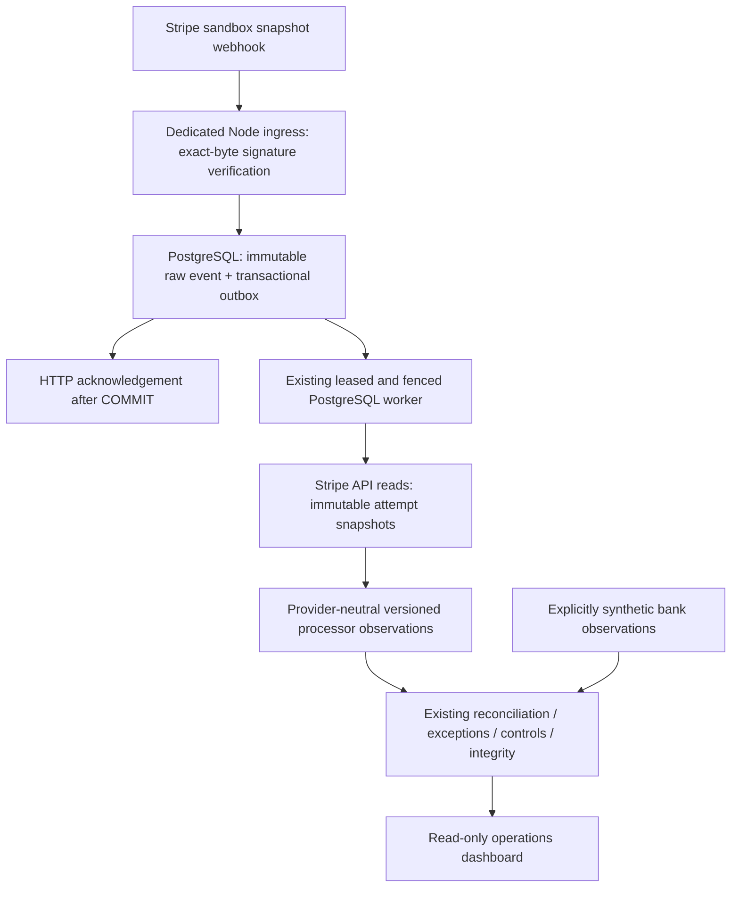

# Phase 14 — Stripe sandbox evidence ingestion

Implementation: sandbox-only external evidence adapter. Verification status is recorded separately in [verification.md](verification.md); actual signed Stripe sandbox capture/fee verification has **PASSED**. No live processing or Phase 15 work is implemented.

## Architecture



`apps/integrations` is a loopback-only ingress process. `libs/stripe-integration` contains the official SDK, signature validation, allowlist, bounded API reader and mapping. `libs/stripe-postgres` connects those adapters to Phase 3 acceptance and the Phase 10 worker. Core Money, ledger, matching, exceptions and controls never import Stripe SDK types. The dedicated processes remain part of one modular monolith, as recorded in [ADR-017](../architecture/adr/017-external-processor-ingress.md).

## Sandbox and account boundary

Runtime requires `STRIPE_MODE=sandbox`. API keys must match a recognized test-secret or restricted-test format; obvious live keys and unknown key formats fail startup. Every accepted event requires `livemode=false`; supported resources require sandbox evidence, with a linked sandbox Charge check for Refund objects that lack a mode field. One configured Stripe account and source is supported. Any Event `account` or `context`, Connect transfer fields or live resource fails closed. Root-account snapshot events often omit an account field: correct association of the endpoint signing secret to its configured account is an operator configuration trust boundary. Workers and backfill independently retrieve the API account and compare its identity before interpretation/acquisition. Key-prefix checks supplement these boundaries and do not prove all future key formats safe.

Only the official **Stripe Node SDK 23.0.0** is added. API reads explicitly pin **2026-09-30.endive**, a stable SDK-compatible version inspected before implementation. Raw events retain their event-time `api_version`; only this exact version is interpreted. Other versions remain immutable accepted evidence with terminal unsupported processing, never guessed mappings. Snapshot events are required; thin notifications are not silently treated as financial snapshots. See [SDK releases](https://github.com/stripe/stripe-node/releases) and [API versioning](https://docs.stripe.com/api/versioning).

## Event allowlist and HTTP contract

The endpoint accepts only these financial types:

```text
charge.succeeded
refund.created
refund.updated
refund.failed
charge.dispute.created
charge.dispute.funds_withdrawn
charge.dispute.funds_reinstated
charge.dispute.closed
payout.created
payout.paid
payout.failed
payout.reconciliation_completed
```

Listening for a type does not imply every economic lifecycle is supported. Recovery/failure types are accepted as evidence so unsupported financial changes remain visible. Unknown types return 400 and receive no interpretation or trusted receipt; configure the Stripe destination to the same explicit allowlist.

| Request/outcome                                                              | Response                                                        |
| ---------------------------------------------------------------------------- | --------------------------------------------------------------- |
| POST `/webhooks/stripe`, durably committed event                             | 200 accepted                                                    |
| Durably known identical event                                                | 200 duplicate                                                   |
| Same event identity with conflicting evidence                                | 409 evidence_conflict                                           |
| Invalid/missing/expired signature, invalid envelope, live or foreign context | 400 rejected                                                    |
| Signed event outside allowlist                                               | 400 unsupported_event                                           |
| Wrong webhook method                                                         | 405, Allow: POST                                                |
| Body larger than configured limit                                            | 413                                                             |
| Database acceptance fails or COMMIT outcome is uncertain                     | 503; retry the same event                                       |
| GET `/health/live`                                                           | 200 when process can respond                                    |
| GET `/health/ready`                                                          | 200 for source-bound local PostgreSQL capability, otherwise 503 |
| GET `/metrics`                                                               | Process-local, fixed-name text counters                         |

The Node HTTP handler buffers exact raw bytes before parsing. Default and maximum body size is 1 MiB, including chunked requests. Body, request and header deadlines are five seconds. Official `constructEvent` validates the raw Buffer with a nonzero 300-second timestamp tolerance; no middleware parses/re-serializes before verification. Up to two explicitly configured signing secrets permit rotation: configure old,new, restart ingress, rotate the endpoint, confirm new signatures, then remove the old secret and restart. Secrets/signatures are never persisted or logged. Stripe retries receive newly signed requests and event-level deduplication handles the already-known event. [Stripe webhook documentation](https://docs.stripe.com/webhooks) supports these signature, retry, duplicate and ordering requirements.

## Durability, provenance and duplicates

`stripe.accept_event` validates the session-bound source, sandbox envelope and allowlist, then calls existing Phase 3 acceptance. One explicit READ COMMITTED transaction with `synchronous_commit=on` persists the exact event bytes, digest, arrival, event identity/type/API version/object identity, source scope, processing record, append-only audit and outbox registration. HTTP 200 follows COMMIT. API calls and financial mapping happen later.

Migration `013_stripe_sandbox.sql` adds immutable `stripe.source`, `principal_binding`, `event`, `snapshot` and `completion`, plus a provider-neutral processor interpretation policy. Owner-only `stripe.configure` binds an existing test source to ingress/worker logins. Ingress gets only the source-bound readiness/acceptance capability; the worker gets existing operational worker privileges and fenced snapshot/apply/completion functions. Neither can directly insert processor/ledger facts, call generic ingestion or reconfigure bindings. Operations retains its original reader role and cannot read unrestricted raw/API payloads.

The source-account lock and `(source,event_id)` uniqueness serialize duplicate acceptance. Repeated webhook acquisition must match original bytes and semantic content; byte-different webhook reuse is conservatively a conflict. API recovery may serialize the same event differently and may update nonfinancial `pending_webhooks`; acquisition equivalence permits that difference while preserving original bytes. Material financial differences never overwrite evidence. Different event IDs can describe one object: economic components use Balance Transaction identity (`txn:...` gross/fee components) and canonical financial content, rather than envelope identity. Event time is preserved but is not a unique ordering key; arrival order never selects financial truth.

API snapshots are immutable decoded SDK JSON, labeled as such, not claimed as exact HTTP wire bytes. Canonical movement/settlement records are explicitly adapter projections and carry an artifact linking API snapshots, event and work attempt. An operator can trace processor derivation → canonical interpretation/raw record → source event and API snapshot using existing evidence identities. The read dashboard receives bounded provider/environment/account/event/type/version/representation labels through the existing reconciliation detail view; no sensitive payload enters React.

## Mapping and financial uncertainty

| Evidence                                            | Implemented interpretation                                                                         | Conservative refusal                                                                                      |
| --------------------------------------------------- | -------------------------------------------------------------------------------------------------- | --------------------------------------------------------------------------------------------------------- |
| Successful captured Charge                          | Exact `amount_captured`, authoritative Charge balance transaction, separate negative fee           | Uncaptured/unsupported Charge, source/amount/currency mismatch                                            |
| Successful Refund                                   | Distinct negative movement per refund balance transaction; parent Charge evidence retained         | Pending waits with bounded retry; failed/canceled or failure reversal stays unresolved                    |
| Dispute                                             | Linked-charge negative withdrawal balance transactions and authoritative fee                       | Positive reinstatement, won/recovery lifecycle or unsupported category                                    |
| Balance Transaction                                 | Integer gross/fee/net, explicit source and currency, created time, API available time retained     | Unsafe integer, net mismatch, FX, fee credit or unsupported type                                          |
| Automatic paid Payout with completed reconciliation | Settlement from payout evidence, explicit paginated payout-filtered membership, exact conservation | Manual/failed/reversing payout, incomplete reconciliation, unsupported members or absent membership proof |

Fees come only from Stripe financial evidence; no percentage calculation exists. Monetary conversion validates safe SDK integers before `BigInt`; unsafe values are rejected. All calculations use existing exact Money and currency definitions. Currently PHP and USD are supported by the repository catalog; additional currencies, including different minor-unit scales, are refused until explicitly supported. There is no assumption that an arbitrary Stripe currency has two decimals and no currency aggregation.

Each payout member is discovered by the supported Balance Transactions `payout` filter for an automatic payout, and its source object is fetched/validated. The payout's own balance debit is not membership. Every member/component must be recognized, uniquely identified and conserve exact payout amount; no subset-sum guessing exists. Explicit paginated membership can feed the existing settlement model and exact reconciliation rule. Relevant current definitions are [Charge](https://docs.stripe.com/api/charges/object), [Refund](https://docs.stripe.com/api/refunds/object), [Dispute](https://docs.stripe.com/api/disputes/object), [Balance Transaction](https://docs.stripe.com/api/balance_transactions/object), [payout-filtered transactions](https://docs.stripe.com/api/balance_transactions/list) and [Payout](https://docs.stripe.com/api/payouts/object).

Unsupported reinstatement/refund-failure/payout-failure reversals are deliberately not mapped into invented captures or a new financial product. Their raw event persists, the work result is visible and financial assurance remains UNKNOWN/invalidated. Any accepted external event whose processing is not NORMALIZED conservatively invalidates current source assurance and marks settlement composition insufficient. This preserves frozen evaluations/allocations and prevents a known historical payout from remaining falsely current after an unrepresented change. A previously terminal event is not automatically superseded by a later good event; this V1 can therefore retain UNKNOWN for the source indefinitely. Manual requeue, safe supersession and new reversal economics are limitations requiring separately reviewed work.

## Worker failures and replay

`StripeEvidenceWorker` extends the established worker; it is not another queue. Atomic outbox registration chooses `stripe-evidence` version 1. Ordinary workers cannot claim this handler; bound Stripe workers cannot claim a different book's Stripe work. DB-clock leases, tokens, attempt history and ownership checks fence every new snapshot, projection and completion. Immutable snapshots bind each attempt's API evidence. Economic projection and the durable completion receipt commit atomically; replay after a lost acknowledgement sees completion and creates no second effect. Unknown COMMIT returns an explicit uncertain outcome and recovers with the original identity/token.

Official SDK requests have a five-second timeout and `maxNetworkRetries=0`; worker retries own the bounded policy. The SDK can still retry a closed stale connection once internally for a read. No runtime method creates financial Stripe objects. Failure categories separate network/timeout, rate limit and 5xx from authentication/configuration, invalid request, not found and unsupported schema. Retry-After guidance increases the existing backoff within a one-hour bound. New Stripe work has a minimum one-second base delay and thirty-second maximum configured exponential delay; existing policy attempt budgets remain authoritative. Pending enrichment requests a thirty-second delay. Permanent failures terminate visibly, and all retries remain finite. [Rate limits](https://docs.stripe.com/rate-limits) and [API idempotency](https://docs.stripe.com/api/idempotent_requests) informed the adapter; sandbox POST tooling, if introduced later, must use deterministic semantic idempotency keys.

Pool sizes are four for ingress/worker and two for one-shot backfill/verification. Connection acquisition is one second; read statements are bounded, and evidence transactions set five-second lock and ten-second statement/idle deadlines. Clients are released/discarded on failure and owned processes/pools/servers are closed. Timeout/unavailable never becomes an empty healthy financial result. Readiness checks only the local bound capability, so an intermittent Stripe API outage does not prevent durable webhook acceptance. Financial PASS/FAIL/UNKNOWN remains in existing control/integrity reads.

## Bounded Events API recovery

`pnpm stripe:backfill <from-epoch-seconds> <to-epoch-seconds> [max-pages]` accepts explicit windows within a conservative 29-day horizon. Stripe documents recent Event retention of thirty days; historical Event payload schemas retain their event-time characteristics. This command fetches all bounded pages before accepting the window through the same `stripe.accept_event` path. Limit is 100 objects/page and 1–10 pages; repeated cursors, malformed pages or exhaustion fail explicitly. Payout membership pagination uses the same protections. See [Events API](https://docs.stripe.com/api/events/list).

Recovery uses explicit replayable windows rather than a hidden time-only checkpoint. Repeat windows with overlap, including after partial durable acceptance; event identity deduplicates safely. No durable incremental watermark claims complete evidence. More than 1,000 objects requires splitting the interval with overlap. Backfill failure does not erase already accepted receipts. Its summary always reports completeness UNKNOWN. Neither normalized received events nor successful polling proves history outside the available horizon or independent processor/bank completeness.

## Logging and metrics

Ingress emits structured timestamp, level, subsystem, operation, generated request ID, duration, outcome and verified event/source-record identities. The request ID is observability metadata only. Worker attempt logs retain stable operation/failure classification; fixed process-local API counters emit a dated JSON snapshot approximately every thirty seconds and at shutdown. Backfill includes a fixed-counter snapshot in its bounded summary.

Ingress `/metrics` exports `stripe_webhook_{received,verified,rejected,duplicate,ingestion_failure,accepted,unsupported}_total`; verified means signature plus supported sandbox envelope validated. Adapter counters are `stripe_api_request_total`, `stripe_api_failure_total`, `stripe_api_duration_ms_total`, `stripe_backfill_event_total` and `stripe_normalization_failure_total`. There are no event/account/object IDs in metric labels, no hosted observability dependency and no unbounded trace storage. Counters belong to the process executing the operation; ingress normally has zero API requests because enrichment runs elsewhere. Worker snapshots are not global/current financial truth. Secrets, complete signatures, cards, raw payloads, arbitrary SQL parameters and simulator oracle are excluded from logs/metrics.

## Developer workflow

Existing simulator/demo/build/test workflows need no Stripe configuration. Normal CI uses local official-SDK signatures and real disposable PostgreSQL; it never contacts Stripe. For the real sandbox workflow:

1. Install the pinned workspace dependencies and start a local PostgreSQL instance using the existing repository workflow. Load the offline `DATABASE_ADMIN_URL` securely and run `pnpm db:migrate`. Never reuse this connection in runtime processes.
2. In an owner/admin provisioning session, create a test book and register its source through `ingestion.register_source`. Create distinct non-owner login roles inheriting only `flow_stripe_ingress` and `flow_stripe_worker`; supply login passwords through your local secret manager, not literal shell examples. Bind them using owner-only `stripe.configure`. Example SQL below uses psql variables containing nonsecret identities.
3. Set the placeholders in [.env.example](../../.env.example) through runtime configuration. No tool automatically loads an environment file. Ingress only needs signing secrets; the worker/backfill require a sandbox API key with read access to the implemented resources. Ensure account and webhook/API version correspond to the pinned API version.
4. Start `pnpm stripe:ingress` and `pnpm stripe:worker` in separate terminals. Ingress listens on `127.0.0.1:4242` by default. Check both technical health endpoints.
5. Use the official Stripe CLI `stripe login`, then `stripe listen --events <comma-separated-allowlist> --forward-to http://127.0.0.1:4242/webhooks/stripe`. Configure the CLI forwarding endpoint's signing secret securely in ingress and restart it. Use the sandbox account/default API version pinned above; do not use live or Connect/thin flags. Alternatively configure a sandbox snapshot destination with this version. See the current [Stripe CLI reference](https://docs.stripe.com/cli).
6. Generate a coherent test-mode captured payment/refund in the Stripe Dashboard or official sandbox tooling. Flow itself exposes no payment-creation endpoint. An automatic payout demonstration also requires Stripe to make authoritative member evidence available; manual/generated payouts do not prove membership.
7. Inspect durable Phase 3 evidence, existing worker attempts and processor interpretations; run existing reconciliation/exception/control/integrity commands for the configured mapping and open the established ops dashboard. Bank-side demo observations must be explicitly labeled `synthetic-bank-demo`, never claimed as independent external bank proof.
8. Run an explicit overlapping backfill window, then `pnpm stripe:verify:sandbox`. The latter fetches existing real sandbox evidence from the last day, runs the real worker and requires processor derivation from that same recent window. Missing credentials is exit 2 BLOCKED; unsupported or unavailable evidence is failure, not external success.

If you use a local, git-ignored `.env` rather than exported process variables, load it explicitly with the installed Node runtime. Secret values stay in local configuration rather than command arguments. The API verification path does not require the Stripe CLI; signed forwarding does.

```text
pnpm exec node --env-file=.env --import tsx apps/integrations/src/main.ts
pnpm exec node --env-file=.env --import tsx tools/stripe-worker.ts
pnpm exec node --env-file=.env --import tsx tools/stripe-verify-sandbox.ts
```

The three commands start separate processes; run ingress and worker in their own terminals. These explicit environment-file commands do not change ordinary test/demo configuration or make `.env` load automatically. The sandbox verification command still requires a provisioned source, narrow database logins and a supported real sandbox event from the recent window.

```sql
-- Admin provisions the two LOGIN roles securely beforehand and grants only:
GRANT flow_stripe_ingress TO flow_stripe_ingress_login;
GRANT flow_stripe_worker TO flow_stripe_worker_login;
-- Execute the remaining provisioning as the existing trusted owner.
SET ROLE flow_ledger_owner;
INSERT INTO ledger.book(id, code, environment)
VALUES (:'book_id'::uuid, :'book_code', 'test');
SELECT ingestion.register_source(jsonb_build_object(
  'bookId', :'book_id', 'environment', 'test',
  'provider', 'stripe', 'externalAccountId', :'stripe_account_id')) AS source_id \gset
SELECT stripe.configure(:'source_id'::uuid, :'stripe_account_id',
  'flow_stripe_ingress_login', 'ingress');
SELECT stripe.configure(:'source_id'::uuid, :'stripe_account_id',
  'flow_stripe_worker_login', 'worker');
RESET ROLE;
```

This is **real Stripe sandbox processor evidence + synthetic bank evidence** when real verification is available. A bank observation constructed from a payout demonstrates plumbing and exact reconciliation mechanics; it does not independently prove external completeness. Local signed fixtures are contract evidence only.

## Limits and deferred work

The external verification gate passed with real signed sandbox capture/fee evidence; refund, dispute and payout external demonstrations are not claimed by that run. Scope also excludes live Stripe, financial POST endpoints, customers/billing/subscriptions/checkout, Connect, real bank ingestion, FX, unrepresented reversal economics, cloud deployment, production identity, AI, new queues, arbitrary N:M, web financial mutation and Phases 15–16. No prior performance optimization, index, cache or materialized view is added or relaxed. Full Phase 1–13 verification remains required; operational readiness remains distinct from financial assurance.
